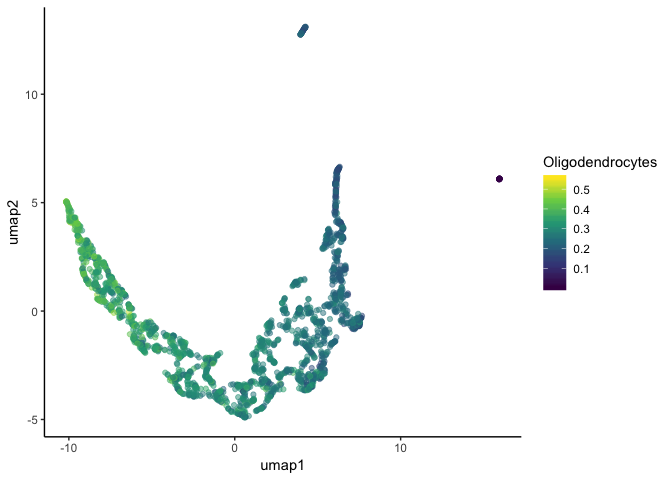

snRNA-seq workflow: bioconductor
================
Saskia Freytag
08/04/2019

-   [Prerequisities](#prerequisities)
    -   [Required libraries](#required-libraries)
-   [Overview](#overview)
-   [Data import](#data-import)
    -   [Loading data](#loading-data)
    -   [Combining data](#combining-data)
-   [Filtering](#filtering)
    -   [Filtering of nuclei](#filtering-of-nuclei)
    -   [Filtering of genes](#filtering-of-genes)
-   [Normalization](#normalization)
    -   [Library size normalization](#library-size-normalization)
    -   [Principal component analysis](#principal-component-analysis)
    -   [Performing batch correction](#performing-batch-correction)
-   [Clustering](#clustering)
    -   [Calculating dimension reduction](#calculating-dimension-reduction)
    -   [Calculate hexagon cell representation](#calculate-hexagon-cell-representation)
    -   [Filtering apoptotic nuclei](#filtering-apoptotic-nuclei)
    -   [Building neighbour graph and clustering](#building-neighbour-graph-and-clustering)
-   [Annotation](#annotation)
    -   [Classifying nuclei by marker genes](#classifying-nuclei-by-marker-genes)
    -   [Annotation by correlation](#annotation-by-correlation)
-   [Rescaling of batches](#rescaling-of-batches)
-   [Trajectory analysis](#trajectory-analysis)
    -   [Investigating mature genes](#investigating-mature-genes)
-   [Interactive instance](#interactive-instance)
    -   [Setting up iSEE](#setting-up-isee)
-   [References](#references)

Prerequisities
--------------

### Required libraries

``` r
library(DropletUtils)
library(scater)
library(scran)
library(batchelor)
library(umap)
library(schex)
library(pheatmap)
```

``` r
library(iSEE)
library(ggplot2)
theme_set(theme_classic())
```

``` r
library(org.Mm.eg.db)
library(annotate)
```

Overview
--------

This workflow demonstrates the analysis of single cell nuclei RNA-sequencing (snRNA-seq) data from importing the count data, clustering to visualization of results with an interactive web browser instance. Since the 10x Genomics protocol is by far the most popular protocol for the generation of this type of data, this workflow uses two example datasets provided on their [website](https://support.10xgenomics.com/single-cell-gene-expression/datasets). The first dataset contains measurements from ~1,000 nuclei from the brain of a E18 mouse. The second dataset contains measurements from ~2,000 nuclei from the brain of an adult mouse (&gt;8 weeks). For both datasets we downloaded the files contained in the folder named `filtered_gene_bc_matrices`. This folder is produced during processing with the 10x Genomics software [CellRanger](https://support.10xgenomics.com/single-cell-gene-expression/software/pipelines/latest/what-is-cell-ranger). It contains three files that are required to produce a count table for each cell and gene.

Unfortunately, [CellRanger](https://support.10xgenomics.com/single-cell-gene-expression/software/pipelines/latest/what-is-cell-ranger) recently changed its naming convention for the files contained within `filtered_gene_bc_matrices`. For this workflow we need to rename the file called `features.tsv` to its earlier naming convention - `genes.tsv`.

Data import
-----------

### Loading data

For this workflow, let's assume the `filtered_gene_bc_matrices` folders for both datasets have been renamed `Adult` and `E18`. Furthermore, assume that these folders are subdirectories of a directory of a directory called `raw`, which is a subdirectory of a directory called `data`, resulting in the following file structure:

    data/
    |-- raw/
        |-- Adult/
        |   |-- mm10
        |-- E18/
            |-- mm10

First we need to load the data contained in these folders into memory and reconstruct the count matrix. Fortunately, the function `read10xCounts` in the package [DropUtils](https://bioconductor.org/packages/release/bioc/html/DropletUtils.html) takes care of both these tasks. It will store the count matrix as well as relevant meta data regarding genes and cells in a `SingleCellExperiment` object from the [SingleCellExperiment](https://bioconductor.org/packages/3.9/bioc/html/SingleCellExperiment.html) package.

As we are dealing with multiple datasets, we will use the power of `lapply` in order to automate the loading task. This will result in a list of `SingleCellExperiment` objects, with each corresponding to one of our datasets.

``` r
samples <- list.files(here::here("data/raw"))
dat <- lapply(samples, function(x)
  read10xCounts(here::here("data/raw", x, "mm10")))
names(dat) <- samples
```

### Combining data

We combine the two objects into a single `SingleCellExperiment` object. However, to successfully achieve this we will firstly need to verify that the genes in both objects are in the same order. Secondly, we will create an idenifier for each sample as an additional column in the cell meta information. Note that this will also work with more than two objects.

``` r
all_rownames <- lapply(dat, rownames)
stopifnot(all(sapply(all_rownames, identical, all_rownames[[1]])))

for (i in 1:length(samples)) {
  dat[[i]]$Sample_ID <- samples[i]
}

sce <- do.call(cbind, dat)
sce$Sample_ID <- as.factor(sce$Sample_ID)
```

**Note:** If you have both samples generated with version 2 and version 3 10x Genomics chemistry, you will need to slightly modify version 3 data structure in order to fit version 2. It also requires an identifier for whether a sample was generated with version 2 or version 3 10x Genomics chemistry. Here we assume that this identifier is called `chemistry`. So instead of running the previous chunk of code, the following code should be run.

``` r
all_rownames <- lapply(dat, rownames)
stopifnot(all(sapply(all_rownames, identical, all_rownames[[1]])))

for (i in 1:length(samples)) {
  dat[[i]]$Sample_ID <- samples[i]
  if(chemistry == "version 3"){
    rowData(dat[[i]]) <- rowData(dat[[i]])[,1:2]
  }
}

sce <- do.call(cbind, dat)
sce$Sample_ID <- as.factor(sce$Sample_ID)
```

Filtering
---------

### Filtering of nuclei

Low-quality nuclei need to be removed in order to ensure that technical effects do not distort downstream analysis results.

#### Filtering nuclei by mitochondrial and nuclear ribosomal content

Data from nuclei should not contain any RNA from mitochondrial genes, as these can only be found in the cytoplasm (Nagy et al. 2018). Any nuclei with high mitochondrial content points to debris being sequenced instead of a nuclei and should therefore be removed (Luecken and Theis 2019). Hence, we filter any nuclei with greater than 10% total mitochondrial contamination. I also removed any nuclei with greater than 20% total ribosomal content. The threshold here had to be set very tolerantly, but should probably be lowered for better quality datasets. To ascertain the mitochondrial and ribosomal content in each nuclei, we use the `calculateQCMetrics` from the [scater](https://bioconductor.org/packages/release/bioc/html/scater.html) package. This function will store the percentage of mitochondrial content as well as several other quality metrics for future use in the column meta data of the `SingleCellExperiment` object.

``` r
rowData(sce)$Mito <- grepl("^mt-", rowData(sce)$Symbol)
rowData(sce)$Ribo <- grepl("Rpl", rowData(sce)$Symbol)
sce <- calculateQCMetrics(sce,
  feature_controls = list(Mt = rowData(sce)$Mito, Rp=rowData(sce)$Ribo)
)

no_nuclei_mito <- sapply(levels(sce$Sample_ID), function(x)
  sum((colData(sce)$pct_counts_Mt > 10)[sce$Sample_ID == x]))

no_nuclei_ribo <- sapply(levels(sce$Sample_ID), function(x)
  sum((colData(sce)$pct_counts_Rp > 20)[sce$Sample_ID == x]))

paste0(
  "Nuclei with more than 10% mitochondrial percentage in ", samples, ": ",
  no_nuclei_mito, " (", round(no_nuclei_mito / sapply(
    levels(sce$Sample_ID),
    function(x) sum(sce$Sample_ID == x)
  ), 2) * 100, "%)"
)
```

    ## [1] "Nuclei with more than 10% mitochondrial percentage in Adult: 1063 (45%)"
    ## [2] "Nuclei with more than 10% mitochondrial percentage in E18: 84 (9%)"

``` r
paste0(
  "Nuclei with more than 20% ribosomal percentage in ", samples, ": ",
  no_nuclei_ribo, " (", round(no_nuclei_ribo / sapply(
    levels(sce$Sample_ID),
    function(x) sum(sce$Sample_ID == x)
  ), 2) * 100, "%)"
)
```

    ## [1] "Nuclei with more than 20% ribosomal percentage in Adult: 0 (0%)"
    ## [2] "Nuclei with more than 20% ribosomal percentage in E18: 62 (6%)"

``` r
rm_mito <- colData(sce)$pct_counts_Mt > 10
rm_ribo <- colData(sce)$pct_counts_Rp > 20

sce <- sce[, !(rm_mito|rm_ribo)]

no_nuclei <-  sapply(levels(sce$Sample_ID), function(x)
  sum(sce$Sample_ID == x))

paste0(
  "After removal of nuclei in ", samples, ": ",
  no_nuclei
)
```

    ## [1] "After removal of nuclei in Adult: 1289"
    ## [2] "After removal of nuclei in E18: 858"

#### Filtering nuclei by total RNA content and diversity

Next we filter any nuclei that have library sizes three standard below the median. We also filter any nuclei with a number of expressed features three standard deviations below the median. Here the library size is defined as the total sum of counts across all genes. The number of expressed features in each cell is defined as the number of features with non-zero counts for that nuclei (Lun, McCarthy, and Marioni 2016). Since we already calculated the quality metrics necessary for this in the previous step, we will only need to identify which nuclei are three standard deviations below the median for these metrics.

``` r
libsize_drop <- isOutlier(sce$total_counts,
  nmads = 3,type = "lower", log = TRUE
)
feature_drop <- isOutlier(sce$total_features_by_counts,
  nmads = 3, type = "lower", log = TRUE
)

no_nuclei_libsize <- sapply(levels(sce$Sample_ID), function(x)
  sum(libsize_drop[sce$Sample_ID == x]))
no_nuclei_feature <- sapply(levels(sce$Sample_ID), function(x)
  sum(feature_drop[sce$Sample_ID == x]))

paste0(
  "Nuclei not passing library size filter ", samples, ": ",
  no_nuclei_libsize, " (", round(no_nuclei_libsize /
    sapply(
      levels(sce$Sample_ID),
      function(x) sum(sce$Sample_ID == x)
    ), 2) * 100, "%)"
)
```

    ## [1] "Nuclei not passing library size filter Adult: 0 (0%)"
    ## [2] "Nuclei not passing library size filter E18: 0 (0%)"

``` r
paste0(
  "Nuclei not passing feature filter ", samples, ": ",
  no_nuclei_feature, " (", round(no_nuclei_feature /
    sapply(
      levels(sce$Sample_ID),
      function(x) sum(sce$Sample_ID == x)
    ), 2) * 100, "%)"
)
```

    ## [1] "Nuclei not passing feature filter Adult: 0 (0%)"
    ## [2] "Nuclei not passing feature filter E18: 3 (0%)"

``` r
sce <- sce[, !(libsize_drop | feature_drop)]
```

### Filtering of genes

#### Filtering mitochondrial genes

Since mitochondrial genes represent noise, we remove them before further analysis.

``` r
no_mito <- sum(rowData(sce)$Mito)

sce <- sce[!rowData(sce)$Mito, ]

paste0("Mitochondrial genes removed: ", no_mito)
```

    ## [1] "Mitochondrial genes removed: 13"

``` r
paste0("Number of genes remaining: ", dim(sce)[1])
```

    ## [1] "Number of genes remaining: 27985"

#### Filtering genes by expression

Genes with expression close to zero need do not contain valuable information and can in fact distort inference. Thus they should be removed. However there are no clear rules regarding which genes should be removed (Cole et al. 2019). It depends on your as much on your downstream analysis as your dataset. Here we will filter any gene that is seen in less than 1% of all nuclei. This represents a good initial compromise between very harsh filtering, which may result in some cell types going undetected and too lenient filtering, which may result in underpowered tests and problems with discreteness during normalization.

``` r
keep_genes <- nexprs(sce, byrow=TRUE) > (dim(sce)[2] * 0.01)

sce <- sce[keep_genes, ]

paste0("Low-abundance genes removed: ", sum(!keep_genes))
```

    ## [1] "Low-abundance genes removed: 15987"

``` r
paste0("Number of genes remaining: ", dim(sce)[1])
```

    ## [1] "Number of genes remaining: 11998"

Normalization
-------------

### Library size normalization

Before quantitative downstream analysis we need to normalize the data, since different nuclei have different capture efficiencies resulting in vastly different library sizes (Lun, McCarthy, and Marioni 2016). The simplest way to remove this bias is to scale the count data in every nuclei by its total count. Importantly, note that this assumes that most genes are not differentially expressed between any two cells. It has been shown that this performs similarly to more complex normalizations (Lun, McCarthy, and Marioni 2016; Cole et al. 2019).

``` r
sce <- normalize(sce)
```

    ## Warning in .local(object, ...): using library sizes as size factors

### Principal component analysis

We will first run a principal component analysis (PCA). This calculates an orthogonal transformation of the data into a set of linearly uncorrelated variables called principal components. We will intially calculate 50 principle components using the top 1000 most variable genes. While reduction dimension methods have been shown to be reasonably robust to the number of highly variable genes chosen, a number greater than 500 is generally suggested (Klein et al. 2015).

``` r
sce <- runPCA(sce, ncomponents=50, ntop=1000)
```

Principle components do not contribute equally; i.e. the first principle components explain a higher percentage of the variance observed in the data than the bottom principle components. For our downstream analysis we want to include only the principle components that contain significant information. A common method for this is a “scree plot” (Nguyen and Holmes 2019). A scree plot simply shows the percentage of variance explained corresponding to each of the principle components. Ww want to identify a cutoff point, in which the variance explained drops significantly below the level of the one immediately preceding it — the so-called "elbow" point. Here we see this point for principle component 4.

``` r
pca_comp <- data.frame(var_exp=attr(sce@reducedDims$PCA, "percentVar"),
    component=1:length(attr(sce@reducedDims$PCA, "percentVar")))
pca_comp$label <- paste0("PC", pca_comp$component)

ggplot(pca_comp, aes(x=component, y=var_exp, label=label)) + 
  geom_text(angle=45) + theme_classic()
```


### Performing batch correction

In this single cell analysis, the different samples constitute different batches, as their libraries were generated at different times. Batch effects can interfere with statistical inference and thus should be explicitly modelled or removed. Since explicit modelling is not easily possible for clustering, we will remove the batch effect using a strategy that relies on mutual nearest neighbours (MNNs) (Haghverdi et al. 2018).

MNNs are pairs of cells that fullfill the following conditions: Each cell is from a different batch. They are within each other’s set of k nearest neighbors. We assume that the cells within an MNN pair are from the same cell type and should thus have similar expression. Assuming that the batch effect is orthogonal to the biological subspace this information can be used to remove the batch effect - the difference between the paired cells.

MNN has been shown to perform the best in a comprehensive benchmarking study using experimental mixture data (Tian et al. 2019). Furthermore, it is implemented in the easy-to-use `fastMNN()` function from the [batchelor](https://bioconductor.org/packages/devel/bioc/html/batchelor.html) package we will perform MNN correction on the principal components. Note that because we perform it on the prinicpal components, you will need to tell the algorithm how many principle components to consider. You can do so with the help of the parameter `d`, which should be set to the value figured out during the previous step.

MNN identification and correction performed in a low-dimensional space offers some advantages with respect to speed and is sufficient for the downstream steps of clustering, annotation and visualization.

``` r
dat_pca <- batchelor::fastMNN(sce,
  batch = sce$Sample_ID,
  k = 50, d = 4, ndist = 10
)
```

    ## Warning in sweep(centered, 2, w, "/", check.margin = FALSE): 'check.margin' is ignored when 'x' is a DelayedArray object or
    ##   derivative

    ## Warning in (function (jobs, data, centers, info, distance, k, query,
    ## get.index, : tied distances detected in nearest-neighbor calculation

``` r
reducedDim(sce, "corrected") <- reducedDim(dat_pca, "corrected")
```

In order to see how this has worked we will visualize both the nuclei from both datasets in their PCA representation and in their MNN corrected PCA representation. Visualization of the nuclei in a lower dimension as computed with PCA highlights the relationships. Nuclei with similar expression are located closer to each other. In the uncorrected PCA representation we can see that the nuclei clearly cluster by batches. Once we use the MNN corrected PCA representation we find that we have some overlap of both datasets. Note we would not expect a strong overlap as the two samples are from very different developmental times, each with its distinct cell types.

``` r
plot_dat <- data.frame(
  pca1 = reducedDim(sce, "PCA")[, 1],
  pca2 = reducedDim(sce, "PCA")[, 2],
  mnn1 = reducedDim(sce, "corrected")[, 1],
  mnn2 = reducedDim(sce, "corrected")[, 2],
  sample = sce$Sample_ID,
  umi = sce$total_counts
)

ggplot(plot_dat, aes(x = pca1, y = pca2)) +
  geom_point(aes(col = sample), alpha = 0.5) +
  scale_colour_brewer(palette = "Set1") 
```


``` r
ggplot(plot_dat, aes(x = mnn1, y = mnn2)) +
  geom_point(aes(col = sample), alpha = 0.5) +
  scale_colour_brewer(palette = "Set1")
```


Clustering
----------

### Calculating dimension reduction

With many nuclei visualization in PCA representation is not optimal, as nuclei from different populations may not be separated. A more appropriate dimension reduction technique in this situtation is the Uniform Manifold Approximation and Projection (UMAP) (McInnes, Healy, and Melville 2018). Unlike other advanced dimension reduction techniques, it presevers local and global structure, whilst having a shorter run time. Furthermore, it has been shown by Becht et al. (2019) that it also provides the most reproducibility and most meaningful organization of cells into clusters. Note that the UMAP representation takes the corrected principal components in its calculation thus also producing a batch-corrected dimension reduction.

``` r
sce <- runUMAP(sce, use_dimred = "corrected", n_neighbors = 20)
```

``` r
plot_dat$umap1 <- reducedDim(sce, "UMAP")[, 1]
plot_dat$umap2 <- reducedDim(sce, "UMAP")[, 2]

ggplot(plot_dat, aes(x = umap1, y = umap2)) +
  geom_point(aes(col = sample), alpha = 0.5) +
  scale_colour_brewer(palette = "Set1") 
```


### Calculate hexagon cell representation

Hexagon cell plotting of one of the dimension reductions is an excellent alternative to traditional plotting. In particular, it can have huge advantages when the number of nuclei is very large. In such cases points are typically plotted on top of each other. With hexagon cell plotting the cells in a close vicinty are instead summarized, thus avoiding overplotting. In order to see whether we have chosen the right number of hexagon cells (controlled by the parameter `nbins`), we will first plot the number of nuclei in each hexagon cell. This should reveal a roughly even plot.

``` r
sce <- make_hexbin(sce, nbins=40, dimension_reduction = "UMAP")
plot_hexbin_density(sce)
```


### Filtering apoptotic nuclei

We suspect that some of the nuclei clustering far from the bulk, contain apoptotic nuclei. These should be removed as they can distort analysis (Lun, McCarthy, and Marioni 2016). In order to verify this we overlay the UMAP representation of all nuclei with their summed expression of all genes in the GO apoptosis pathway. It turns out that the nuclei are not apoptotic and are therefore not removed. **Note that if nuclei were removed, it is imperative that all dimension reduction representations are recalculated!**

``` r
go_entrez_id <- get("GO:0006915", revmap(org.Mm.egGO))
apoptotic_genes <- unlist(mget(go_entrez_id , org.Mm.egENSEMBL))

index_apoptotic <- match(apoptotic_genes, rownames(sce))
index_apoptotic <- index_apoptotic[!is.na(index_apoptotic)]
colData(sce)$apoptotic <- colMeans(logcounts(sce)[index_apoptotic, ])

plot_hexbin_meta(sce, col="apoptotic", action="mean")
```


### Building neighbour graph and clustering

We use the corrected principal components for clustering. Note that it would be a bad idea to use the UMAP representation as they are distorted. Furthermore, using the UMAP representation for plotting the independently arisen clustering is a great sanity check. We will perform nuclei by building a shared nearest neighbour (SNN) (Xu and Su 2015) graph with the function in `buildSNNGraph` in [scran](https://bioconductor.org/packages/release/bioc/html/scran.html). SNN graph are assessing the similarity between two cells in their local neighborhoods. This measure effectively pools neighbor information across many cells and is thus robust to aberrant connections in the neighbor graph. Here we choose to set `k=50`, which determines the number of clusters. As a general rule with more nuclei in your dataset this should be increased. After generating the SNN, we will use the Louvain algorithm (De Meo et al. 2011) to identify clusters.

This approach mimics the way Seurat clusters cells. This type of clustering has been shown to be highly effective for 10x data in particular (Freytag et al. 2018). However, Louvain clustering is known to perform poorly on smaller datasets (Kiselev, Andrews, and Hemberg 2019).

``` r
set.seed(10)
snn_gr <- buildSNNGraph(sce, use.dimred = "corrected", k = 50)
clusters <- igraph::cluster_louvain(snn_gr)
table(clusters$membership, sce$Sample_ID)
```

    ##    
    ##     Adult E18
    ##   1   167 312
    ##   2   261   1
    ##   3   339  60
    ##   4   285   0
    ##   5   179  90
    ##   6     5 167
    ##   7    53 225

Finally we will visualize each nuclei's cluster membership in the UMAP representation of the data.

``` r
sce$Cluster <- factor(clusters$membership)

plot_dat$cluster <- sce$Cluster

ggplot(plot_dat, aes(x = umap1, y = umap2)) +
  geom_point(aes(col = cluster), alpha = 0.5) +
  scale_colour_brewer(palette = "Set1")
```


Annotation
----------

### Classifying nuclei by marker genes

We downloaded marker genes for all cell types in the mouse from [mousebrain.org](http://mousebrain.org/celltypes/) (Zeisel et al. 2018). Using this we can visualize the main cell populations in the UMAP representation. We do this by summarizing the expression of marker genes for the main cell populations. This shows that all major cell populations are present in the sample.

``` r
known_markers <- read.table(here::here(
  "data/meta/",
  "mouse_brain_cell_type_markers.txt"
), sep = "\t", fill = TRUE, header = T)

all_cell_types <- sapply(
  as.character(known_markers$Description),
  function(x) strsplit(x, ",")[[1]][1]
)
known_markers$CellType <- all_cell_types

glia_markers <- sapply(
  which(known_markers$Neurotransmitter == ""),
  function(x) unlist(strsplit(as.character(known_markers$Markers[x]), " "))
)
vglut1_markers <- sapply(
  grep("VGLUT1", known_markers$Neurotransmitter),
  function(x) unlist(strsplit(as.character(known_markers$Markers[x]), " "))
)
vglut2_markers <- sapply(
  grep("VGLUT2", known_markers$Neurotransmitter),
  function(x) unlist(strsplit(as.character(known_markers$Markers[x]), " "))
)
GABA_markers <- sapply(
  grep("GABA", known_markers$Neurotransmitter),
  function(x) unlist(strsplit(as.character(known_markers$Markers[x]), " "))
)


markers <- list(
  gaba = unlist(GABA_markers),
  glia = unlist(glia_markers),
  vglut1 = unlist(vglut1_markers),
  vglut2 = unlist(vglut2_markers)
)

cell_type_means <- sapply(markers, function(x) {
  index <- match(x, rowData(sce)$Symbol)
  index <- index[!is.na(index)]
  return(colMeans(as.matrix(logcounts(sce[index, ]))))
})
colnames(cell_type_means) <- names(markers)

plot_dat <- cbind(plot_dat, cell_type_means)

for (i in colnames(cell_type_means)) {
  gg <- ggplot(plot_dat, aes(x = umap1, y = umap2)) +
    geom_point(aes_string(color = i), alpha=0.5) + scale_color_viridis_c()

  print(gg)
}
```


We also downloaded marker genes for all cell types from the human brain from Velmeshev et al. (2019). Using this we can visualize the finer cell populations in the UMAP representation. We do this by again summarizing the expression of marker genes for the main cell populations.

``` r
human_markers <- readxl::read_xls(here::here(
  "data/meta/",
  "brain_cluster_genes_aav8130_Data-S3.xls"
))

all_cell_types <- unique(human_markers$`Cell type`)

cell_type_means <- sapply(all_cell_types, function(x) {
  markers <- human_markers$`Gene name`[human_markers$`Cell type`==x]
  index <- match(tolower(markers), tolower(rowData(sce)$Symbol))
  index <- index[!is.na(index)]
  return(colMeans(as.matrix(logcounts(sce[index, ]))))
})

colnames(cell_type_means) <- gsub("/", "_", colnames(cell_type_means))
colnames(cell_type_means) <- gsub("-", "_", colnames(cell_type_means))

plot_dat1 <- plot_dat[, c("umap1", "umap2")]
plot_dat1 <- cbind(plot_dat1, cell_type_means)

for (i in colnames(cell_type_means)) {
  gg <- ggplot(plot_dat1, aes(x = umap1, y = umap2)) +
    geom_point(aes_string(color = i), alpha=0.5) + scale_color_viridis_c()

  print(gg)
}
```



### Annotation by correlation

In order to guide annotation of clusters, automated cluster annotations like [scmap](https://bioconductor.org/packages/release/bioc/html/scmap.html) (which works on `SingleCellExperiment` objects) can be used. However, for this dataset such methods did not result in sensible annotation. A more reliable method is to correlate the mean expression of a chosen set of highly variable genes in each cluster with their mean expression across annotated clusters in a reference dataset. The resulting correlation can then be plotted in a heatmap, thus guiding cluster annotation. Here we will use the [Allen Mouse Brain Atlas](https://mouse.brain-map.org/) as a reference dataset. Refer to the document on `Processing the Reference Dataset` for more details.

``` r
ref_sce <- readRDS(here::here("data/meta/", "allen_mouse_atlas.rds"))

hvg <- intersect(rowData(ref_sce)$gene_symbol[rowData(ref_sce)$hvg], 
                 rowData(sce)$Symbol)

rowData(ref_sce)$hvg <- rowData(ref_sce)$gene_symbol %in% hvg
rowData(sce)$hvg <- rowData(sce)$Symbol %in% hvg
```

Note that we work with the Spearman correlation, which is a more robust way of measuring correlation. For each cluster we can then identify the most likely label present in the reference dataset.

``` r
mean_sce <- sapply(unique(colData(sce)$Cluster), function(x) 
  apply(logcounts(sce[rowData(sce)$hvg, 
    which(colData(sce)$Cluster==x)]), 1, mean))

mean_sce_ref <- sapply(unique(colData(ref_sce)$class), function(x) 
  apply(logcounts(ref_sce[rowData(ref_sce)$hvg, 
    which(colData(ref_sce)$class==x)]), 1, mean))

cor_sce <- apply(mean_sce, 2, function(x)
  apply(mean_sce_ref, 2, function(y) cor(x, y, method="spearman")))
colnames(cor_sce) <- unique(colData(sce)$Cluster)

pheatmap(cor_sce)
```


Rescaling of batches
--------------------

``` r
sce_rescale <- rescaleBatches(sce, batch = sce$Sample_ID)
```

Trajectory analysis
-------------------

Still to come!

### Investigating mature genes

``` r
mature_genes <- c("Map2", "Rbfox3")
index_mature <- match(mature_genes, rowData(sce)$Symbol)
index_mature <- index_mature[!is.na(index_mature)]
plot_dat$mature <- colMeans(as.matrix(logcounts(sce[index_mature, ])))

ggplot(plot_dat, aes(x = umap1, y = umap2)) +
  geom_point(aes(color = mature)) + scale_color_viridis_c()
```


Interactive instance
--------------------

### Setting up iSEE

Next we will use the [iSEE](https://github.com/csoneson/iSEE) package to provide an interactive user interface for sharing and exploring the data further. It is extremely easy to set this up when data and analysis results are stored in a `SingleCellExperiment` object, as we have done during this workflow. The user interface is implemented with [RStudio's Shiny](https://shiny.rstudio.com/), with a multi-panel setup for ease of navigation.

``` r
rownames(sce) <- rowData(sce)$Symbol
sce <- sce [!duplicated(rownames(sce)), ]

fexArg <- featAssayPlotDefaults(sce, 2)
fexArg$YAxisFeatName <- c("Map2", "Rbfox3")
fexArg$ColorBy <- c("Column data", "Column data")
fexArg$ColorByColData <- c("Cluster", "Sample_ID")

rdArgs <- redDimPlotDefaults(sce, 2)
rdArgs$DataBoxOpen <- FALSE
rdArgs$Type <- c("UMAP", "corrected")
rdArgs$ColorBy <- c("Column data", "Column data")
rdArgs$ColorByColData <- c("Cluster", "Sample_ID")
rdArgs$XAxis <- c(1, 1)
rdArgs$YAxis <- c(2, 2)

init <- DataFrame(
  Name = c(
    "Reduced dimension plot 1", "Feature assay plot 1",
    "Reduced dimension plot 2", "Feature assay plot 2"
  ),
  Width = c(6, 6)
)

app <- iSEE(sce,
  initialPanels = init, featAssayArgs = fexArg,
  redDimArgs = rdArgs
)
```

To initialize simply run `app` to launch the web instance.

References
==========

Becht, Etienne, Leland McInnes, John Healy, Charles-Antoine Dutertre, Immanuel WH Kwok, Lai Guan Ng, Florent Ginhoux, and Evan W Newell. 2019. “Dimensionality Reduction for Visualizing Single-Cell Data Using Umap.” *Nature Biotechnology* 37 (1). Nature Publishing Group: 38.

Cole, Michael B, Davide Risso, Allon Wagner, David DeTomaso, John Ngai, Elizabeth Purdom, Sandrine Dudoit, and Nir Yosef. 2019. “Performance Assessment and Selection of Normalization Procedures for Single-Cell Rna-Seq.” *Cell Systems* 8 (4). Elsevier: 315–28.

De Meo, Pasquale, Emilio Ferrara, Giacomo Fiumara, and Alessandro Provetti. 2011. “Generalized Louvain Method for Community Detection in Large Networks.” In *2011 11th International Conference on Intelligent Systems Design and Applications*, 88–93. IEEE.

Freytag, Saskia, Luyi Tian, Ingrid Lönnstedt, Milica Ng, and Melanie Bahlo. 2018. “Comparison of Clustering Tools in R for Medium-Sized 10x Genomics Single-Cell Rna-Sequencing Data.” *F1000Research* 7. Faculty of 1000 Ltd.

Haghverdi, Laleh, Aaron TL Lun, Michael D Morgan, and John C Marioni. 2018. “Batch Effects in Single-Cell Rna-Sequencing Data Are Corrected by Matching Mutual Nearest Neighbors.” *Nature Biotechnology* 36 (5). Nature Publishing Group: 421.

Kiselev, Vladimir Yu, Tallulah S Andrews, and Martin Hemberg. 2019. “Challenges in Unsupervised Clustering of Single-Cell Rna-Seq Data.” *Nature Reviews Genetics*. Nature Publishing Group, 1.

Klein, Allon M, Linas Mazutis, Ilke Akartuna, Naren Tallapragada, Adrian Veres, Victor Li, Leonid Peshkin, David A Weitz, and Marc W Kirschner. 2015. “Droplet Barcoding for Single-Cell Transcriptomics Applied to Embryonic Stem Cells.” *Cell* 161 (5). Elsevier: 1187–1201.

Luecken, Malte D, and Fabian J Theis. 2019. “Current Best Practices in Single-Cell Rna-Seq Analysis: A Tutorial.” *Molecular Systems Biology* 15 (6). John Wiley & Sons, Ltd.

Lun, Aaron TL, Davis J McCarthy, and John C Marioni. 2016. “A Step-by-Step Workflow for Low-Level Analysis of Single-Cell Rna-Seq Data with Bioconductor.” *F1000Research* 5. Faculty of 1000 Ltd.

McInnes, Leland, John Healy, and James Melville. 2018. “Umap: Uniform Manifold Approximation and Projection for Dimension Reduction.” *arXiv Preprint arXiv:1802.03426*.

Nagy, Corina, Malosree Maitra, Matthew Suderman, Jean-Francois Theroux, Naguib Mechawar, Jiannis Ragoussis, and Gustavo Turecki. 2018. “Single-Nucleus Rna Sequencing Shows Convergent Evidence from Different Cell Types for Altered Synaptic Plasticity in Major Depressive Disorder.” *bioRxiv*. Cold Spring Harbor Laboratory, 384479.

Nguyen, Lan Huong, and Susan Holmes. 2019. “Ten Quick Tips for Effective Dimensionality Reduction.” *PLOS Computational Biology* 15 (6). Public Library of Science: e1006907.

Tian, Luyi, Xueyi Dong, Saskia Freytag, Kim-Anh Lê Cao, Shian Su, Abolfazl JalalAbadi, Daniela Amann-Zalcenstein, et al. 2019. “Benchmarking Single Cell Rna-Sequencing Analysis Pipelines Using Mixture Control Experiments.” *Nature Methods*. Nature Publishing Group, 1.

Velmeshev, Dmitry, Lucas Schirmer, Diane Jung, Maximilian Haeussler, Yonatan Perez, Simone Mayer, Aparna Bhaduri, Nitasha Goyal, David H Rowitch, and Arnold R Kriegstein. 2019. “Single-Cell Genomics Identifies Cell Type–specific Molecular Changes in Autism.” *Science* 364 (6441). American Association for the Advancement of Science: 685–89.

Xu, Chen, and Zhengchang Su. 2015. “Identification of Cell Types from Single-Cell Transcriptomes Using a Novel Clustering Method.” *Bioinformatics* 31 (12). Oxford University Press: 1974–80.

Zeisel, Amit, Hannah Hochgerner, Peter Lönnerberg, Anna Johnsson, Fatima Memic, Job Van Der Zwan, Martin Häring, et al. 2018. “Molecular Architecture of the Mouse Nervous System.” *Cell* 174 (4). Elsevier: 999–1014.
